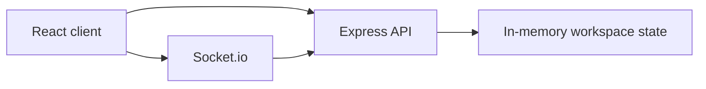

# TaskForge — real-time team kanban prototype

This repo is a local-first portfolio prototype for a collaborative kanban workspace. It is intentionally not presented as a publicly deployed production product.

## Sample local accounts
These credentials are for local demo use only while running the app on your machine:
- demo@waleed.dev / Demo@1234
- admin@waleed.dev / Admin@1234

## Features
- Team workspaces with boards and swimlanes
- Drag-and-drop task movement
- Real-time activity updates over Socket.io
- Comments, labels, deadlines and assignees
- Role checks for member/admin workflows

## Tech stack
- React + Vite
- Node.js + Express
- Socket.io
- In-memory board state for a lightweight prototype

## Architecture


## Getting started
```bash
git clone <repo-url>
cd taskforge
pnpm install
pnpm dev
```

Then open the client locally in the browser and sign in with one of the sample accounts above.

## Validation
```bash
pnpm test
pnpm build
```

## Key engineering decisions
- Socket rooms isolate workspace activity.
- Drag state stays client-side to preserve a responsive board experience.
- Role checks are enforced before writes and task deletion.

## What I'd improve next
- Add persistent storage and a proper multi-workspace data model.
- Add richer permissions, audit history and board-level activity exports.
- Move from a prototype state model to a database-backed product workflow.

## Author
Waleed Ilyas — [GitHub](https://github.com/Waleed-Ilyas) • [LinkedIn](https://www.linkedin.com/in/waleed-ilyas-664839213)
